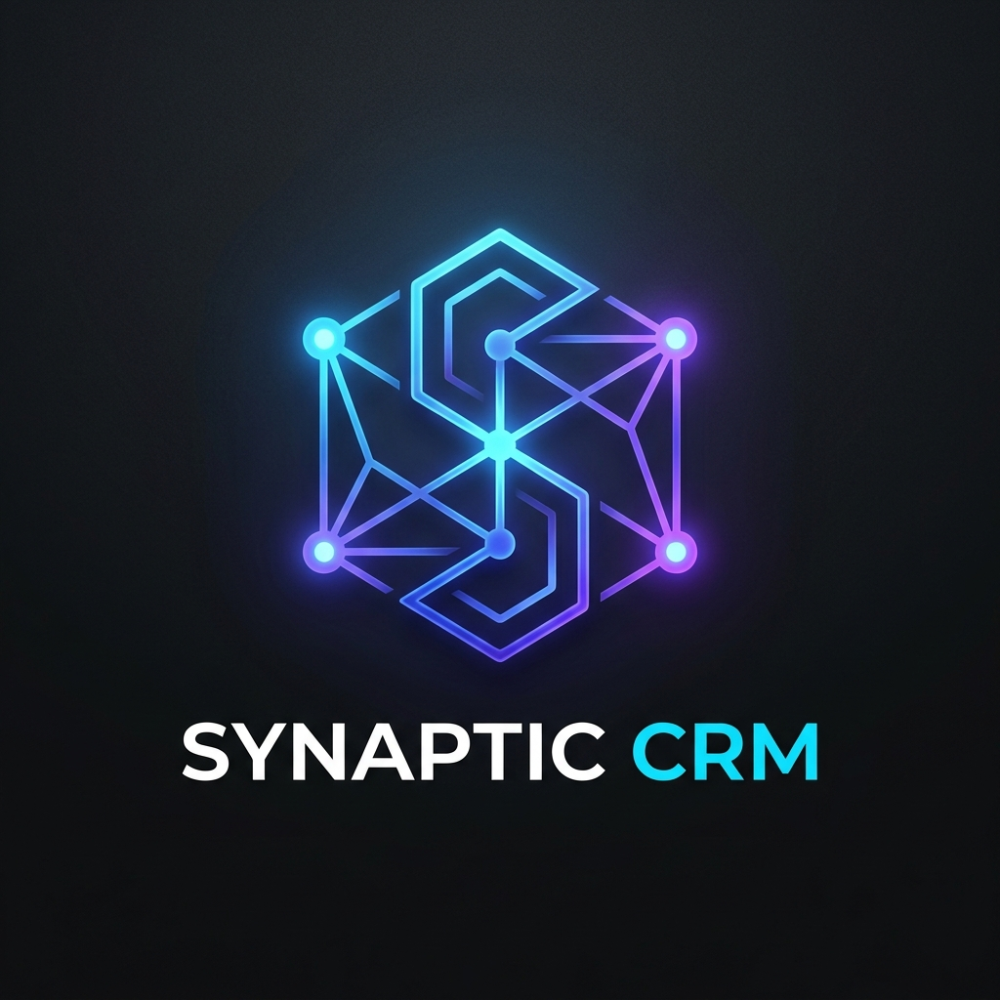
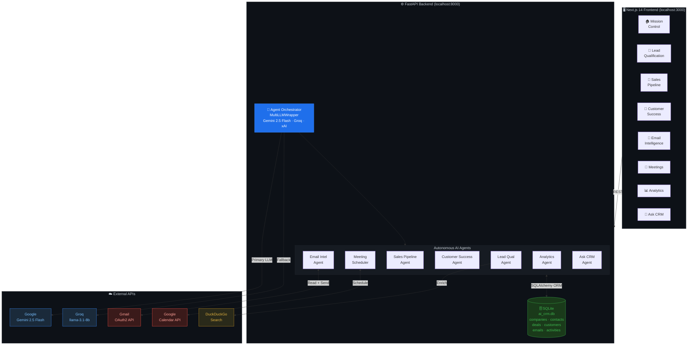
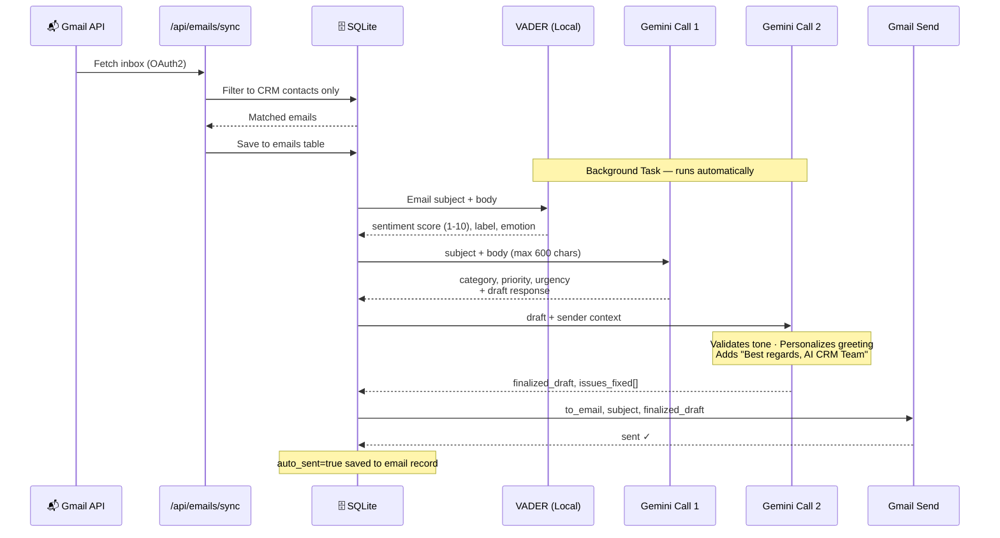

<div align="center">
    

    
# Synaptic CRM - Complete Agentic AI CRM Solution

### Production-Grade CRM Powered by Autonomous AI Agents

[](https://www.python.org/)
[](https://fastapi.tiangolo.com/)
[](https://nextjs.org/)
[](https://www.typescriptlang.org/)
[](https://ai.google.dev/)
[](https://www.sqlite.org/)
[](LICENSE)

[Live Demo](#demo-walkthrough) · [Quick Start](#quick-start) · [Architecture](#architecture) · [API Reference](#api-reference)

</div>

---

## Table of Contents

- [Overview](#overview)
- [What Makes This Different](#what-makes-this-different)
- [Architecture](#architecture)
- [AI Agents](#ai-agents)
- [Tech Stack](#tech-stack)
- [Quick Start](#quick-start)
- [Configuration](#configuration)
- [Project Structure](#project-structure)
- [API Reference](#api-reference)
- [LLM Provider Setup](#llm-provider-setup)
- [Email Integration](#email-integration)
- [Data & Seeding](#data--seeding)
- [Salesforce Sync](#salesforce-sync)
- [Demo Walkthrough](#demo-walkthrough)
- [Troubleshooting](#troubleshooting)

---

## Overview

**AI CRM** is a full-stack Customer Relationship Management system where every workflow is powered by real, autonomous AI agents. Built on FastAPI + Next.js 14, it uses **Google Gemini 2.5 Flash** as its primary reasoning engine with automatic fallback to Groq and xAI/Grok.

The system ships with **7 production agents** that collaborate in real time: qualifying leads, drafting and auto-sending email replies, monitoring deal health, predicting customer churn, scheduling meetings, generating analytics reports, and answering natural-language queries against your live CRM database.

---

## What Makes This Different

| Capability | Description |
|---|---|
| **Real LLM Execution** | Every agent call hits a live API — no cached or pre-computed results |
| **Self-Healing SQL** | Ask CRM agent retries failed queries up to 3× with error feedback to the LLM |
| **VADER + LLM Hybrid** | Email sentiment runs locally via VADER (zero cost, zero latency); category/priority via LLM |
| **Two-Pass Email Pipeline** | Draft LLM → Validator LLM → Gmail auto-send, no human needed |
| **Real Execution Timing** | Step animations replay the *actual* wall-clock time of each LLM call |
| **Multi-LLM Failover** | Gemini → Groq → xAI/Grok, all via a single OpenAI-compatible client |
| **Lead Score Breakdown** | LLM returns per-dimension scores (company size, title, industry, engagement, budget) |
| **Privacy-Safe Queries** | PII redacted before any DB data reaches the LLM |

---

## Architecture

### System Architecture



---

### Agent Collaboration Graph

```mermaid
graph LR
    subgraph INPUT["Inbound Triggers"]
        NL["New Lead\nForm / CRM List"]
        EM["Gmail Inbox\nIncoming Email"]
        DL["CRM Deal\nSelected"]
        CU["CRM Customer\nSelected"]
        NQ["Natural Language\nQuery"]
    end

    subgraph CORE["AI Agents"]
        LQA["🎯 Lead\nQualification"]
        EIA["📧 Email\nIntelligence"]
        SPA["💼 Sales\nPipeline"]
        CSA["🤝 Customer\nSuccess"]
        ACA["💬 Ask CRM\nSQL Agent"]
        ANA["📊 Analytics\nAgent"]
        MSA["📅 Meeting\nScheduler"]
    end

    subgraph OUTPUTS["Outputs"]
        SCORE["Lead Score\n+ Routing"]
        DRAFT["Validated Draft\n+ Auto-Send"]
        HEALTH["Deal Health\n+ Next Actions"]
        CHURN["Churn Risk\n+ Upsell Ops"]
        REPORT["Executive\nReport"]
        SQL["SQL Result\n+ Narrative"]
        CAL["Calendar\nInvite"]
        TOAST["Auto-email\nToast"]
    end

    NL --> LQA
    EM --> EIA
    DL --> SPA
    CU --> CSA
    NQ --> ACA
    NQ --> ANA

    LQA --> SCORE
    LQA -->|"score ≥ 70"| TOAST
    LQA -->|"notify"| EIA

    EIA --> DRAFT
    EIA -->|"draft → validate → send"| DRAFT

    SPA --> HEALTH
    CSA --> CHURN
    ACA --> SQL
    ANA --> REPORT
    MSA --> CAL

    CSA -->|"churn alert"| EIA
    SPA -->|"stalled deal"| MSA

    style CORE fill:#161b22,stroke:#21262d
    style INPUT fill:#0d1117,stroke:#30363d
    style OUTPUTS fill:#0d1117,stroke:#30363d
    style LQA fill:#0c2d6b,stroke:#388bfd,color:#79c0ff
    style EIA fill:#3a1a00,stroke:#d29922,color:#e3b341
    style SPA fill:#0a2a0a,stroke:#3fb950,color:#56d364
    style CSA fill:#2a0a2a,stroke:#bc8cff,color:#d2a8ff
    style ACA fill:#0a1a2a,stroke:#58a6ff,color:#79c0ff
    style ANA fill:#1a0a0a,stroke:#f85149,color:#ffa198
    style MSA fill:#1a1a0a,stroke:#d29922,color:#e3b341
```



---

### Email Intelligence Pipeline




---

## AI Agents

### 🎯 Lead Qualification Agent
**Endpoint:** `POST /api/leads/workflow`

Scores leads 0–100 using a structured rubric, enriches with web research, and routes to the correct sales team. Fires a welcome email *after* execution steps finish animating.

**Gemini output per call:**
```json
{
  "score": 87,
  "company_size": "enterprise",
  "industry": "Technology",
  "seniority": "executive",
  "budget_likelihood": "high",
  "outreach_priority": "immediate",
  "recommended_action": "Schedule executive demo within 4 hours",
  "score_breakdown": {
    "company_size": 22,
    "job_title": 25,
    "industry": 19,
    "engagement": 12,
    "budget_signals": 9
  },
  "signals": [
    "Company domain confirms B2B intent",
    "CTO title = budget authority",
    "Demo request = high intent"
  ]
}
```

---

### 📧 Email Intelligence Agent
**Endpoint:** `POST /api/emails/analyze` · `POST /api/emails/{id}/send-reply`

Fully automated 4-stage pipeline — no human approval required:

```
Stage 1: VADER Sentiment      → score (1-10), label, emotion        [0ms, local]
Stage 2: Gemini LLM Call 1   → category, priority, urgency, draft   [2-5s]
Stage 3: Gemini LLM Call 2   → validate draft, personalize, sign    [2-4s]
Stage 4: Gmail API            → auto-send reply to original sender   [<1s]
```

The validator (Stage 3) checks tone, personalizes the greeting with the sender's name, ensures the `Best regards, AI CRM Team` closing is present, and removes any `[placeholder]` text before sending.

---

### 💼 Sales Pipeline Agent
**Endpoint:** `POST /api/pipeline/analyze/{deal_id}`

Analyzes deal health using rich context: deal name, company, contact, value, days in stage, last contact date, activity count, blockers, and proposal status. Returns LLM-computed health score, close probability, risk factors, and named next actions.

---

### 🤝 Customer Success Agent
**Endpoint:** `POST /api/customers/monitor/{customer_id}`

Monitors customer health using MRR, industry, login frequency, CSAT, support tickets, payment delays, and renewal date. Detects churn risk and generates prioritized CSM recommendations with customer-specific context.

---

### 📊 Analytics Intelligence Agent
**Endpoint:** `POST /api/analytics/generate`

Queries live SQLite data and generates an executive narrative with KPIs, trend analysis, anomaly detection, and actionable business insights — all from a single Gemini call.

---

### 💬 Ask CRM Agent (Natural Language → SQL)
**Endpoint:** `POST /api/ask`

Converts natural language questions into validated SQLite queries with up to 3 self-healing retries. Returns a privacy-safe data table + Gemini executive summary with specific numbers from the results.

**Business logic the LLM knows:**
```
Revenue    = SUM(deals.value) WHERE stage='closed_won'
Pipeline   = SUM(deals.value) WHERE stage NOT IN ('closed_won','closed_lost')
MRR        = SUM(customers.mrr)
Hot leads  = contacts WHERE lead_score >= 70
Stalled    = deals WHERE is_stalled = 1
Churn risk = customers WHERE churn_risk IN ('high','critical')
```

---

### 📅 Meeting Scheduler Agent
**Endpoint:** `POST /api/meetings/schedule`

AI-powered meeting scheduling with CRM contact matching, conflict detection, and Google Calendar integration.

---

## Tech Stack

### Backend
| Component | Technology | Notes |
|---|---|---|
| **Framework** | FastAPI 0.111 + Python 3.11 | Async/await throughout |
| **ORM** | SQLAlchemy 2 + SQLite | `ai_crm.db`, no setup required |
| **LLM Client** | `openai` Python SDK | Used for all 3 providers |
| **Sentiment** | VADER (`vaderSentiment`) | 100% local, no API cost |
| **Email** | Gmail API v1 (OAuth2) | Real inbox read + send |
| **Calendar** | Google Calendar API v3 | OAuth2 |
| **Search** | DuckDuckGo (HTTP) | Lead enrichment |

### Frontend
| Component | Technology |
|---|---|
| **Framework** | Next.js 14 App Router + TypeScript |
| **Styling** | Vanilla CSS (custom design system) |
| **Charts** | Recharts |
| **Icons** | Lucide React |

### LLM Providers (via OpenAI-compatible SDK)
| Provider | Model | Base URL |
|---|---|---|
| **Gemini** (active) | `gemini-2.5-flash-preview-04-17` | `generativelanguage.googleapis.com/v1beta/openai/` |
| Groq (fallback) | `llama-3.1-8b-instant` | `api.groq.com/openai/v1` |
| xAI/Grok (fallback) | `grok-2-1212` | `api.x.ai/v1` |

---

## Quick Start

### Prerequisites

- Python 3.11+
- Node.js 18+
- A Gemini API key (free at [ai.google.dev](https://ai.google.dev))

### 1. Clone the repository

```bash
git clone https://github.com/your-org/ai-crm.git
cd ai-crm
```

### 2. Backend setup

```bash
# Create and activate virtual environment
python -m venv venv

# Windows
venv\Scripts\activate

# macOS/Linux
source venv/bin/activate

# Install dependencies
cd backend
pip install -r requirements.txt
```

### 3. Configure environment

```bash
cp .env.example .env
```

Edit `backend/.env`:
```env
# Primary LLM — Gemini 2.5 Flash (recommended)
GEMINI_API_KEY=your-gemini-api-key-here
GEMINI_MODEL_NAME=gemini-2.5-flash-preview-04-17
MODEL_PROVIDER=gemini

# Fallback (optional)
GROQ_API_KEY=your-groq-api-key-here

# Email (optional — needed for email send/receive)
GMAIL_API_CREDENTIALS=/path/to/your/client_secret.json
```

### 4. Seed the database

```bash
cd backend
python scripts/seed_data.py
```

This populates `ai_crm.db` with:
- 11 companies, 30 contacts (lead_score 50–100), 20 deals
- 10 customers, 40 activities, 15 meetings, 30 daily metrics

### 5. Start the backend

```bash
python run.py
```

Backend runs at **http://localhost:8000**  
Interactive API docs at **http://localhost:8000/docs**

### 6. Start the frontend

```bash
cd frontend
npm install
npm run dev
```

Frontend runs at **http://localhost:3000**

---

## Configuration

### LLM Provider Selection

The `MODEL_PROVIDER` env var forces a specific provider. Without it, the system auto-detects by checking for API keys in this order: **Groq → Gemini → xAI → Mock mode**.

```env
# Force Gemini (recommended — best reasoning quality)
MODEL_PROVIDER=gemini
GEMINI_MODEL_NAME=gemini-2.5-flash-preview-04-17
GEMINI_API_KEY=...

# Switch to Groq (faster, generous free tier)
# Remove MODEL_PROVIDER or set MODEL_PROVIDER=groq
GROQ_API_KEY=...

# Switch to xAI/Grok
MODEL_PROVIDER=xai
XAI_API_KEY=...
```

### Agent Feature Flags

Individual agents can be toggled in `.env`:
```env
LEAD_QUALIFICATION_ENABLED=true
EMAIL_INTELLIGENCE_ENABLED=true
SALES_PIPELINE_ENABLED=true
CUSTOMER_SUCCESS_ENABLED=true
MEETING_SCHEDULER_ENABLED=true
ANALYTICS_ENABLED=true
```

---

## Project Structure

```
ai-crm/
├── backend/
│   ├── agents/                        # 7 AI Agent implementations
│   │   ├── base_agent.py              # Abstract base with retry, PII redaction
│   │   ├── lead_qualification_agent.py
│   │   ├── email_intelligence_agent.py  # 2-pass: draft + validator LLM
│   │   ├── sales_pipeline_agent.py
│   │   ├── customer_success_agent.py
│   │   ├── meeting_scheduler_agent.py
│   │   ├── analytics_agent.py
│   │   └── ask_crm_agent.py           # NL→SQL with self-healing retry
│   ├── api/                           # FastAPI route handlers
│   │   ├── leads.py
│   │   ├── deals.py
│   │   ├── customers.py
│   │   ├── emails.py
│   │   ├── meetings.py
│   │   ├── analytics.py
│   │   ├── ask.py
│   │   └── sources.py                 # Salesforce/CSV/REST import
│   ├── database/
│   │   ├── models.py                  # SQLAlchemy ORM models
│   │   ├── connection.py              # SQLite engine + session factory
│   │   └── schema.sql                 # Reference SQL schema
│   ├── services/
│   │   ├── gmail_service.py           # OAuth2 email read + send
│   │   ├── calendar_service.py        # Google Calendar integration
│   │   ├── schema_inspector.py        # Live DB schema discovery
│   │   ├── sql_validator.py           # Blocks destructive SQL
│   │   ├── metadata_profiler.py       # PII detection + chart suggestion
│   │   └── web_search_tool.py         # DuckDuckGo enrichment
│   ├── workflows/
│   │   └── orchestrator.py            # MultiLLMWrapper + agent factory
│   ├── scripts/
│   │   └── seed_data.py               # Populates ai_crm.db
│   ├── main.py                        # FastAPI app + all routers
│   ├── run.py                         # Entry point
│   ├── .env                           # Your config (not committed)
│   ├── .env.example                   # Config template
│   └── requirements.txt
│
├── frontend/
│   ├── app/                           # Next.js 14 App Router pages
│   │   ├── page.tsx                   # Mission Control (dashboard)
│   │   ├── leads/page.tsx             # Lead Qualification Agent
│   │   ├── pipeline/page.tsx          # Sales Pipeline Agent
│   │   ├── customers/page.tsx         # Customer Success Agent
│   │   ├── email/page.tsx             # Email Intelligence Agent
│   │   ├── meetings/page.tsx          # Meeting Scheduler Agent
│   │   ├── analytics/page.tsx         # Analytics Intelligence Agent
│   │   ├── ask/page.tsx               # Ask CRM (NL Query)
│   │   └── sources/page.tsx           # Source Systems
│   ├── components/
│   │   ├── AgentPageLayout.tsx        # Shared agent UI + step animation
│   │   ├── WorkflowSteps.tsx          # Real-timing step replay
│   │   ├── ScoreGauge.tsx             # Animated score circle
│   │   ├── Sidebar.tsx
│   │   └── StatCard.tsx
│   ├── types/index.ts                 # TypeScript interfaces for all agents
│   └── public/
│
├── ai_crm_system_documentation.md    # Detailed system docs (layman + dev)
├── QUICKSTART.md
└── README.md
```

---

## API Reference

### Agent Endpoints

| Method | Endpoint | Description |
|---|---|---|
| `POST` | `/api/leads/workflow` | Run lead qualification agent |
| `POST` | `/api/pipeline/analyze/{deal_id}` | Analyze deal health |
| `POST` | `/api/customers/monitor/{customer_id}` | Monitor customer health |
| `POST` | `/api/emails/analyze` | Batch analyze emails |
| `POST` | `/api/emails/{id}/send-reply` | Send AI-drafted reply |
| `POST` | `/api/meetings/schedule` | Schedule a meeting |
| `POST` | `/api/analytics/generate` | Generate analytics report |
| `POST` | `/api/ask` | Natural language CRM query |

### Data Endpoints

| Method | Endpoint | Description |
|---|---|---|
| `GET` | `/api/leads/` | List all contacts/leads |
| `GET` | `/api/deals/` | List all deals |
| `GET` | `/api/customers/` | List all customers |
| `GET` | `/api/emails/` | List synced emails |
| `GET` | `/api/analytics/dashboard` | Live dashboard KPIs |
| `GET` | `/api/analytics/pipeline` | Pipeline stage breakdown |
| `POST` | `/api/emails/sync` | Sync Gmail inbox |

### Source Import Endpoints

| Method | Endpoint | Description |
|---|---|---|
| `POST` | `/api/sources/import/salesforce` | Import Salesforce objects |
| `POST` | `/api/sources/import/excel` | Upload CSV/Excel file |
| `POST` | `/api/sources/import/api` | Push records via REST |
| `GET` | `/api/sources/status` | Connection status for all sources |

---

## LLM Provider Setup

### Google Gemini (Recommended)

1. Get a free API key at [ai.google.dev](https://ai.google.dev)
2. In `backend/.env`:
   ```env
   GEMINI_API_KEY=AIza...
   GEMINI_MODEL_NAME=gemini-2.5-flash
   MODEL_PROVIDER=gemini
   ```

### Groq (Fastest Free Tier)

1. Get a free API key at [console.groq.com](https://console.groq.com)
2. In `backend/.env`:
   ```env
   GROQ_API_KEY=gsk_...
   # Remove MODEL_PROVIDER to let Groq take priority
   ```

### xAI / Grok

```env
XAI_API_KEY=xai-...
MODEL_PROVIDER=xai
```

### Mock Mode (No API Key)

If no API key is configured, all agents run in mock mode and return:
```
[LLM unavailable after 3 retries: No API key found]
```

---

## Email Integration

The Email Intelligence Agent requires Gmail OAuth2 credentials for full functionality.

### Setup

1. Create a project in [Google Cloud Console](https://console.cloud.google.com)
2. Enable the **Gmail API** and **Google Calendar API**
3. Create OAuth 2.0 credentials (Desktop App type)
4. Download the `client_secret_*.json` file
5. Set the path in `backend/.env`:
   ```env
   GMAIL_API_CREDENTIALS=/path/to/client_secret_xxx.json
   ```
6. In the UI, click **Connect Gmail** — complete the OAuth flow
7. A `token.json` is saved to `backend/credentials/`

### What Happens After Connection

```
Gmail Inbox (real emails)
     ↓
/api/emails/sync  →  filters to CRM contacts only
     ↓
Saved to emails table in SQLite
     ↓
Background task: EmailIntelligenceAgent runs automatically
     ├── VADER sentiment (local, instant)
     ├── Gemini: category + priority + draft response
     ├── Gemini validator: personalizes greeting, adds "AI CRM Team" signature
     └── Gmail API: sends reply automatically
```

---

## Data & Seeding

### Seed the database

```bash
cd backend
python scripts/seed_data.py
```

### Seeded records

| Table | Count | Notes |
|---|---|---|
| `companies` | 11 | Real industry names + domains |
| `contacts` | 30 | `lead_score` 50–100, various job titles |
| `deals` | 20 | All pipeline stages represented |
| `customers` | 10 | Mixed churn risk levels + MRR |
| `activities` | 40 | Call logs, emails, meetings |
| `meetings` | 15 | Scheduled across contacts + companies |
| `daily_metrics`| 30 | 30 days of KPI history |

### Re-seed (drops and re-populates all records)

```bash
python scripts/seed_data.py
```

> The script uses UTF-8 encoding and avoids emoji characters in print statements to ensure Windows compatibility.

---

## Salesforce Sync

The Source Systems page (`/sources`) includes a **Salesforce Simulation** that demonstrates how external CRM data is ingested.

### Input format (Salesforce Object JSON)

```json
[
  {
    "Id": "SF-001",
    "AccountName": "Tesla Inc",
    "Website": "tesla.com",
    "Industry": "Automotive",
    "BillingCity": "Austin",
    "FirstName": "Elon",
    "LastName": "Musk",
    "Title": "Technoking",
    "Amount": 500000
  }
]
```

### Field mapping to CRM schema

| Salesforce Field | CRM Table | CRM Column |
|---|---|---|
| `AccountName` | `companies` | `name` |
| `Website` | `companies` | `domain` |
| `Industry` | `companies` | `industry` |
| `BillingCity` | `companies` | `location` |
| `Id` | `companies.enrichment_data` | `{"source":"Salesforce","sf_id":"..."}` |
| `FirstName` / `LastName` | `contacts` | `first_name` / `last_name` |
| `Title` | `contacts` | `job_title` |
| `Amount` | `deals` | `value` |

Records are **upserted** (not duplicated): matched by domain for companies, and by `company_id + lead_source='Salesforce'` for contacts.

---

## Demo Walkthrough

### 10-Minute Demo Flow

```
1. Mission Control (1 min)
   → Show live KPIs from real SQLite data

2. Lead Qualification Agent (2 min)
   → Select a lead from the CRM list
   → Run Agent → Gemini scores (3-6s)
   → Show: Outreach Priority banner, Score Breakdown bars, Buying signals
   → Wait for auto-email toast (fires after step animation ends)

3. Sales Pipeline Agent (2 min)
   → Select any deal → Run Agent
   → Show: Health score, risk factors, deal-specific next actions

4. Customer Success Agent (2 min)
   → Select customer → Run Agent
   → Show: Churn risk level, upsell opportunities, CSM recommendations

5. Email Intelligence (2 min)
   → Connect Gmail → Sync inbox
   → Email auto-analyzed, drafted, validated, and sent by agent
   → Show: "AI CRM Team" signature in draft

6. Ask CRM (1 min)
   → Type: "Show me top 5 deals by value"
   → Real SQL + result table + Gemini narrative summary
```

---

## Troubleshooting

### Backend won't start

```bash
# Check Python version (requires 3.11+)
python --version

# Reinstall dependencies
pip install -r backend/requirements.txt

# Verify .env exists
ls backend/.env
```

### LLM returns mock output

```
[LLM unavailable after 3 retries: ...]
```

- Check your API key in `backend/.env`
- Verify `MODEL_PROVIDER` matches your key: `gemini`, `groq`, or `xai`
- Check your API quota at the provider dashboard

### Database errors after model change

```bash
# Apply schema changes (adds new columns without dropping data)
cd backend
python -c "from database.connection import engine; from database.models import Base; Base.metadata.create_all(bind=engine); print('OK')"
```

### Gmail sync returns 0 emails

- Ensure OAuth flow completed and `token.json` exists in `backend/credentials/`
- Only emails from addresses matching CRM contacts are imported
- Check that the Gmail scopes include `gmail.readonly` and `gmail.send`

### Re-seed and reset

```bash
cd backend
rm ai_crm.db
python -c "from database.connection import engine; from database.models import Base; Base.metadata.create_all(bind=engine)"
python scripts/seed_data.py
```

---

## Contributing

1. Fork the repository
2. Create a feature branch: `git checkout -b feature/your-feature`
3. Commit your changes: `git commit -m 'Add your feature'`
4. Push and open a Pull Request

Please follow the existing code style (FastAPI async patterns on backend, TypeScript strict mode on frontend).

---

## License

MIT © 2026 AI CRM

---

<div align="center">

**Built for modern revenue teams · By Shrimanta Satpati**

[⭐ Star this repo](https://github.com/your-org/ai-crm) · [🐛 Report a bug](https://github.com/your-org/ai-crm/issues) · [💡 Request a feature](https://github.com/your-org/ai-crm/issues)

</div>